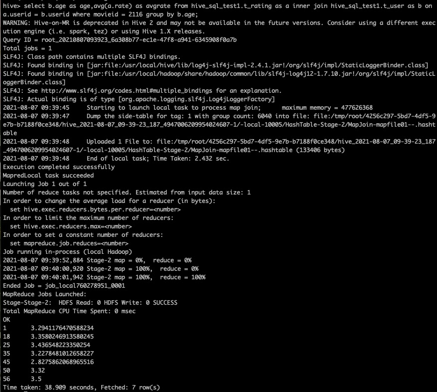
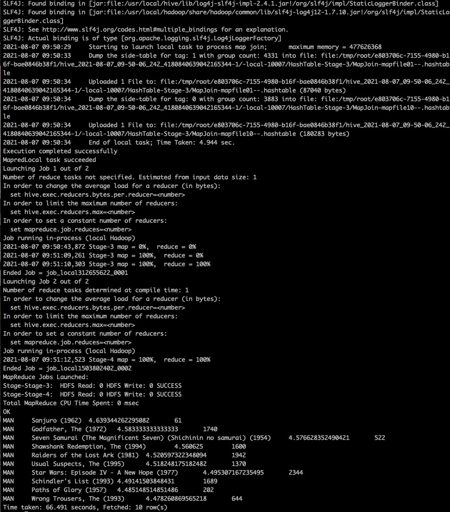
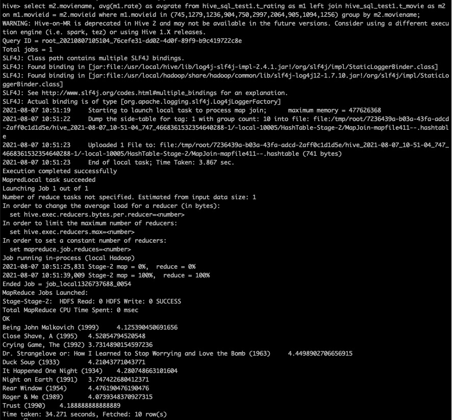

# hive 作业
## 作业1
sql语句：
```
select b.age as age,avg(a.rate) as avgrate from hive_sql_test1.t_rating as a inner join hive_sql_test1.t_user as b on a.userid = b.userid where movieid = 2116 group by b.age;
```
查询结果


## 作业2
sql语句：
```
select * from (select 'MAN' as sex, a.moviename as name, avg(b.rate) as avgrate, count(b.rate) as total from hive_sql_test1.t_movie as a left join hive_sql_test1.t_rating as b on a.movieid= b.movieid left join hive_sql_test1.t_user as c on b.userid = c.userid where c.sex = 'M' group by a.moviename) as t where t.total > 50 order by t.avgrate desc limit 0,10;
```
查询结果


## 作业3
sql语句：
```
select t1.movieid,t1.rate,t1.userid from hive_sql_test1.t_rating as t1 inner join (select a.userid, count(a.movieid) as count from hive_sql_test1.t_rating as a inner join hive_sql_test1.t_user as b on a.userid = b.userid where b.sex = 'F' group by a.userid order by count desc limit 0,1) as t2 on t1.userid = t2.userid order by t1.rate desc limit 0,10;
select m2.moviename, avg(m1.rate) as avgrate from hive_sql_test1.t_rating as m1 left join hive_sql_test1.t_movie as m2 on m1.movieid = m2.movieid where m1.movieid in (745,1279,1236,904,750,2997,2064,905,1094,1256) group by m2.moviename;
```
查询结果


## 作业4
程序文件 geekfileformat
GeekTextInputFormat 用于解密
GeekTextOutputFormat 用于加密
