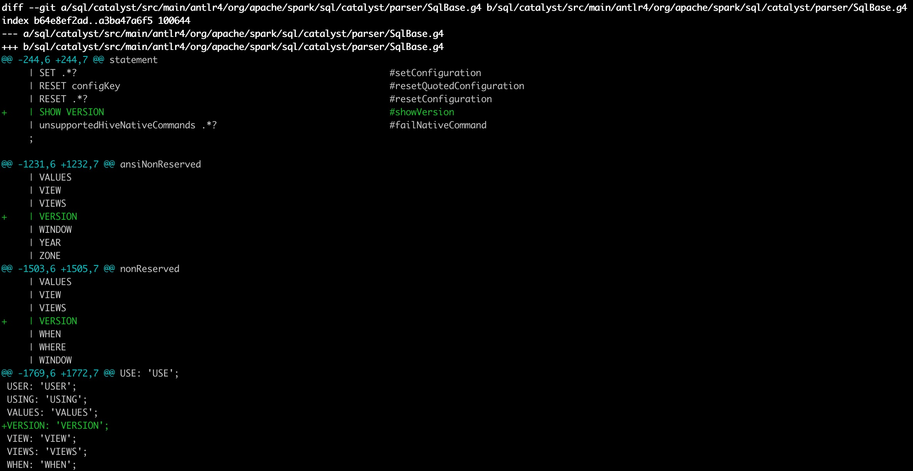
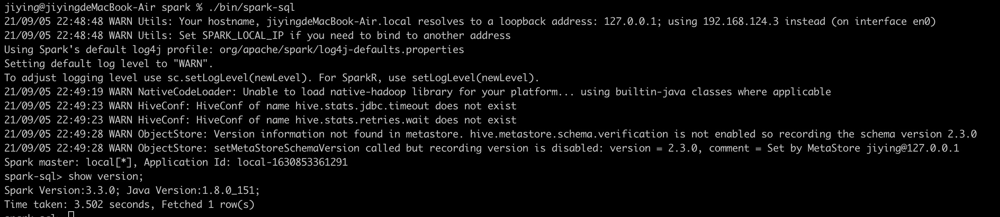

#作业1:为Spark SQL添加一条自定义命令
1.SqlBase.g4添加相关参数


2.通过antlr4编译出SqlBaseParser.java

3.在sql/core/src/main/scala/org/apache/spark/sql/execution/SparkSqlParser.scala中添加
```
  override def visitShowVersion(ctx: ShowVersionContext): LogicalPlan = withOrigin(ctx) {
     ShowVersionCommand()
  }
```

4.添加ShowVersionCommand
```
case class ShowVersionCommand() extends LeafRunnableCommand {
  override val output: Seq[Attribute] =
    Seq(AttributeReference("version", StringType, nullable = true)())

  override def run(sparkSession: SparkSession): Seq[Row] = try {
    val javaVersion = System.getProperty("java.version")
    val outputString = "Spark Version:3.3.0; Java Version:" + javaVersion + ";"
    Seq(Row(outputString))
  } catch { case NonFatal(cause) =>
    ("Error occurred during query planning: \n" + cause.getMessage).split("\n").map(Row(_))
  }
}
```

5.运行结果

